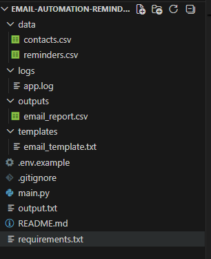
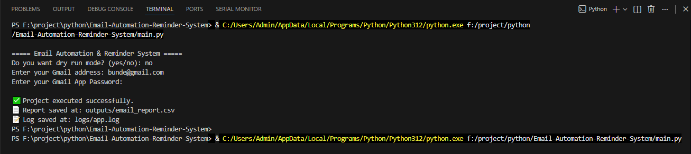
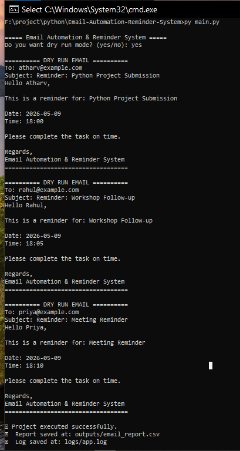
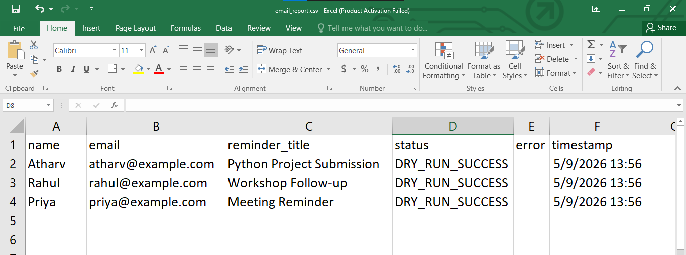
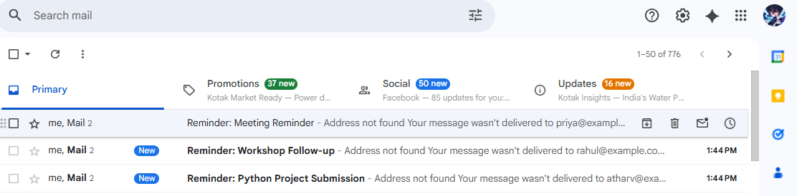

````md
# Email Automation & Reminder System

## Project Overview

The Email Automation & Reminder System is a Python-based automation project designed to send reminder emails automatically using contact and reminder data stored in CSV files. The system personalizes email templates, generates reports, and logs email activity for tracking purposes.

This project demonstrates how Python can automate repetitive communication tasks such as reminders, notifications, follow-ups, and alerts.

---

# Problem Statement

In companies, colleges, training institutes, HR departments, and business teams, manually sending reminder emails is repetitive and time-consuming. Teams often forget deadlines, meetings, webinars, assignment reminders, or follow-up emails.

This project solves that problem by automating email communication using Python.

---

# Industry Relevance

This project is useful for:

- HR Teams
- Training Institutes
- Startups
- Operations Teams
- Customer Support Teams
- Educational Organizations
- Business Productivity Automation

Real-world use cases:

- Meeting reminders
- Webinar notifications
- Assignment reminders
- Follow-up emails
- Deadline alerts
- Payment reminders
- Task notifications

---

# Features

- Read contacts from CSV
- Read reminders from CSV
- Personalized email templates
- Gmail SMTP integration
- Dry-run testing mode
- Logging system
- CSV report generation
- Beginner-friendly Python code
- GitHub-ready project structure
- Safe password handling

---

# Tech Stack

## Programming Language
- Python

## Libraries Used
- pandas
- smtplib
- email.message
- logging
- datetime
- getpass

---

# Project Workflow

```text
Contact CSV
      ↓
Reminder CSV
      ↓
Load Email Template
      ↓
Personalize Email
      ↓
Send Email / Dry Run
      ↓
Generate Logs
      ↓
Generate CSV Report
````

---

# Folder Structure

```text
Email-Automation-Reminder-System/
│
├── data/
│   ├── contacts.csv
│   └── reminders.csv
│
├── templates/
│   └── email_template.txt
│
├── outputs/
│   └── email_report.csv
│
├── logs/
│   └── app.log
│
├── Image/
│   ├── Dry_email_output.png
│   ├── email_report.png
│   ├── Project_structure.png
│   ├── Real_Gmail_Output.png
│   └── Terminal_output.png
│
├── main.py
├── requirements.txt
├── .gitignore
└── README.md
```

---

# Installation

## Step 1 — Install Python

Download Python:

[https://www.python.org/downloads/](https://www.python.org/downloads/)

While installing:

* Enable "Add Python to PATH"

---

# Install Required Libraries

```bash
pip install pandas
```

---

# How to Run the Project

## Run Program

```bash
python main.py
```

OR

```bash
py main.py
```

---

# Dry Run Mode

Dry run mode simulates email sending without sending real emails.

Example:

```text
Do you want dry run mode? (yes/no):
```

Type:

```text
yes
```

---

# Real Email Mode

For actual email sending:

```text
Do you want dry run mode? (yes/no):
```

Type:

```text
no
```

Then enter:

* Gmail address
* Gmail App Password

---

# Gmail App Password

````md
# Gmail App Password Setup

To send real emails from this Python project, Gmail requires an App Password. Do not use your normal Gmail password.

## Step 1: Open Google Account Security

Go to:

https://myaccount.google.com/security

## Step 2: Turn ON 2-Step Verification

Find:

```text
2-Step Verification
````

Click it and complete the setup.

## Step 3: Open App Passwords

Go to:

[https://myaccount.google.com/apppasswords](https://myaccount.google.com/apppasswords)

## Step 4: Create App Password

Select app/device name:

```text
Python Email Project
```

Then click:

```text
Create
```

## Step 5: Copy the 16-character password

Google will show a password like:

```text
abcd efgh ijkl mnop
```

Copy it.

## Step 6: Use in Project

When the program asks:

```text
Enter your Gmail App Password:
```

Paste the App Password.

Note: While typing or pasting, the password may not be visible in CMD. This is normal for security.

## Important Safety Rules

* Do not share your App Password.
* Do not upload it to GitHub.
* Do not write it inside README.md.
* Do not use your normal Gmail password.
* If leaked, delete it from Google Account settings.

```
```

# Sample Output

## Terminal Output

```text
===== Email Automation & Reminder System =====

Do you want dry run mode? (yes/no): yes

========== DRY RUN EMAIL ==========
To: atharv@example.com
Subject: Reminder: Python Project Submission
===================================

✅ Project executed successfully.
```

---

# Generated Files

## Report File

```text
outputs/email_report.csv
```

Contains:

* Name
* Email
* Reminder Title
* Status
* Timestamp

---

## Log File

```text
logs/app.log
```

Contains:

* Email sending logs
* Error logs
* Success logs

---

# Screenshots

## Project Structure



## Terminal Output



## Dry Run Output



## Email Report



## Real Gmail Output



---

# Learning Outcomes

Through this project, I learned:

* Python automation
* CSV handling
* SMTP email automation
* Error handling
* Logging systems
* Report generation
* GitHub project management
* Automation workflow design

---

# Future Improvements

Future enhancements can include:

* Streamlit dashboard
* WhatsApp reminders
* SMS notifications
* Database integration
* Scheduling system
* Email analytics
* Multi-user support
* Cloud deployment

---

# Interview Questions

## Explain Your Project

This project is a Python-based Email Automation & Reminder System that automates reminder emails using contact and reminder data stored in CSV files. The system personalizes emails, sends reminders through Gmail SMTP, generates reports, and logs email activity. It helps reduce manual communication tasks.

---

# GitHub Topics

```text
python automation smtp email-automation reminder-system productivity pandas
```

---

# Author

## Atharv Bunde
### Mechatronics Student

Mechatronics Engineering Student

GitHub:
[https://github.com/Atharvbunde](https://github.com/Atharvbunde)

Linkdin:
[https://www.linkedin.com/in/atharv-bunde-602361400/]

```
```
